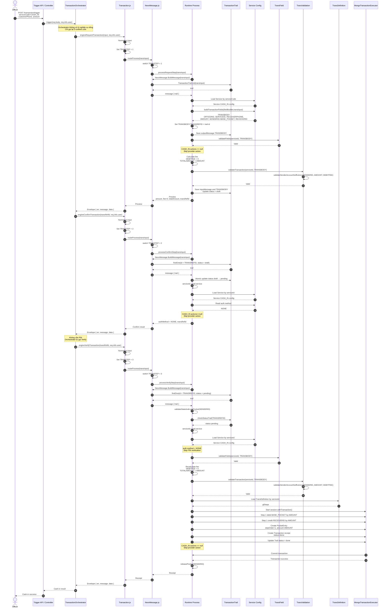

## Sequence — P2P Transfer

---

```mermaid
sequenceDiagram
    autonumber

    actor Customer as Customer
    participant API as Transaction API / Controller
    participant TX as Transaction.js
    participant NM as NeonMessage.js
    participant Engine as Runtime Process
    participant Trail as TransactionTrail
    participant Service as Service Config
    participant Field as TransField
    participant Validation as TransValidation
    participant Definition as TransDefinition
    participant MongoExec as MongoTransactionExecutor

    %% =========================
    %% STEP 1: REQUEST
    %% =========================

    Customer->>API: POST /transaction/request<br/>serviceCode=P2P_TRANSFER<br/>receiverPhone, amount

    API->>TX: engineRequestTransaction(req.body, req.info.user)

    TX->>TX: Normalize input
    TX->>TX: Set TRANSTEP = 1
    TX->>NM: routeProcess(transInput)

    NM->>NM: switch TRANSTEP = 1
    NM->>Engine: processRequestStep(transInput)

    Engine->>NM: NeonMessage.BuildMessage(transInput)
    NM->>Trail: TransactionTrail.init(transInput)
    Trail-->>NM: trail
    NM-->>Engine: message { trail }

    Engine->>Service: Load Service by serviceCode
    Service-->>Engine: Service P2P config

    Engine->>Service: buildTransactionFields(fieldBuilder,transinput)
    Service-->>Engine: TRANSBODY<br/>USERID, SERVICEID, RECEIVERPHONE,<br/>AMOUNT, SENDERID, RECEIVERID

    Engine->>Engine: Set TRANSBODY.TRANSREFID = trail.id
    Engine->>Trail: Save outputMessage.TRANSBODY

    Engine->>Field: validateFields(serviceId, TRANSBODY)
    Field-->>Engine: Valid

    Note over Engine: actions == null = false<br/>Skip provider action

    Engine->>Engine: Calculate fee<br/>DEBITFEE = 100<br/>TOTALAMOUNT = AMOUNT + DEBITFEE

    Engine->>Validation: validateTransaction(serviceId, TRANSBODY)
    Validation->>Validation: validateReceiverIsNotSender(SENDERID, RECEIVERID)
    Validation->>Validation: validateSenderAccountSufficiency(SENDERID, AMOUNT, DEBITFEE)
    Validation-->>Engine: Valid

    Engine->>Trail: Save inputMessage and TRANSBODY<br/>Update status = draft

    Engine-->>NM: Preview<br/>amount, fee, totalAmount, transRefId
    NM-->>TX: Preview
    TX-->>API: Envelope { err, message, data }
    API-->>Customer: Show preview

    %% =========================
    %% STEP 2: CONFIRM
    %% =========================

    Customer->>API: POST /transaction/confirm<br/>transRefId

    API->>TX: engineConfirmTransaction(req.body, req.info.user)

    TX->>TX: Normalize input
    TX->>TX: Set TRANSTEP = 2
    TX->>NM: routeProcess(transInput)

    NM->>NM: switch TRANSTEP = 2
    NM->>Engine: processConfirmStep(transInput)

    Engine->>NM: NeonMessage.BuildMessage(transInput)
    NM->>Trail: findOne(id = TRANSREFID, status = draft)
    Trail-->>NM: trail
    NM-->>Engine: message { trail }
    Engine->>Trail: Atomic update status draft → pending

    Engine->>Engine: serviceId = trail.service
    Engine->>Service: Load Service by serviceId
    Service-->>Engine: Service P2P config

    Engine->>Service: Read auth.method
    Service-->>Engine: PIN

    Note over Engine: actions == null<br/>Skip provider action


    Engine-->>NM: authMethod = PIN, transRefId
    NM-->>TX: Confirm result
    TX-->>API: Envelope { err, message, data }
    API-->>Customer: Ask PIN

    %% =========================
    %% STEP 3: VERIFY
    %% =========================

    Customer->>API: POST /transaction/verify<br/>transRefId, pin

    API->>TX: engineVerifyTransaction(req.body, req.info.user)

    TX->>TX: Normalize input
    TX->>TX: Set TRANSTEP = 3
    TX->>NM: routeProcess(transInput)

    NM->>NM: switch TRANSTEP = 3
    NM->>Engine: processVerifyStep(transInput)

    Engine->>NM: NeonMessage.BuildMessage(transInput)
    NM->>Trail: findOne(id = TRANSREFID, status = pending)
    Trail-->>NM: trail
    NM-->>Engine: message { trail }
    Engine->>Engine: validateStateAndLockPocket(SENDERID)
    Engine->>Trail: checkStatusTrail(TRANSREFID)
    Trail-->>Engine: status pending
    Engine->>Engine: serviceId = trail.service
    Engine->>Service: Load Service by serviceId
    Service-->>Engine: Service P2P config

    Engine->>Engine: Verify PIN(dataObject.user, pin)


    Engine->>Field: validateFields(serviceId, TRANSBODY)
    Field-->>Engine: Valid

    Engine->>Engine: Recalculate fee<br/>DEBITFEE = 100<br/>TOTALAMOUNT = AMOUNT + DEBITFEE

    Engine->>Validation: validateTransaction(serviceId, TRANSBODY)
    Validation->>Validation: validateReceiverIsNotSender(SENDERID, RECEIVERID)
    Validation->>Validation: validateSenderAccountSufficiency(SENDERID, AMOUNT, DEBITFEE)
    Validation-->>Engine: Valid


    Engine->>Definition: Load TransDefinition by serviceId
    Definition-->>Engine: glSteps


    Engine->>MongoExec: Start session.withTransaction()

    Engine->>MongoExec: Step 1 debit SENDERID by AMOUNT
    Engine->>MongoExec: Step 1 credit RECEIVERID by AMOUNT
    Engine->>MongoExec: Create PocketEntry<br/>stepOrder=1, amount=AMOUNT

    Engine->>MongoExec: Step 2 debit SENDERID by DEBITFEE
    Engine->>MongoExec: Step 2 credit SYSTEM_POCKET by DEBITFEE
    Engine->>MongoExec: Create PocketEntry<br/>stepOrder=2, amount=DEBITFEE

    Engine->>MongoExec: Create Transaction receipt<br/>status=done

    Engine->>MongoExec: Update Trail status = done
    Note over Engine: actions == null <br/>Skip provider action
    Engine->>MongoExec: Commit transaction
    MongoExec-->>Engine: Transaction success


    Engine->>Engine: releasePocket(SENDERID)

    Engine-->>NM: Receipt
    NM-->>TX: Receipt
    TX-->>API: Envelope { err, message, data }
    API-->>Customer: Transfer success
```

## Sequence — Cash-in

---

```mermaid
sequenceDiagram
    autonumber

    actor Officer as Officer
    participant API as Trigger API / Controller
    participant ORC as TransactionOrchestrator
    participant TX as Transaction.js
    participant NM as NeonMessage.js
    participant Engine as Runtime Process
    participant Trail as TransactionTrail
    participant Service as Service Config
    participant Field as TransField
    participant Validation as TransValidation
    participant Definition as TransDefinition
      participant MongoExec as MongoTransactionExecutor

    %% =========================
    %% OFFICER TRIGGER
    %% =========================

    Officer->>API: POST /transaction/trigger<br/>serviceCode=CASH_IN<br/>customerPhone, amount

    API->>ORC: trigger(req.body, req.info.user)

    Note over ORC: Orchestrator không xử lý nghiệp vụ riêng<br/>Chỉ gọi lại 3 runtime core

    %% =========================
    %% STEP 1: REQUEST
    %% =========================

    ORC->>TX: engineRequestTransaction(input, req.info.user)

    TX->>TX: Normalize input
    TX->>TX: Set TRANSTEP = 1

    TX->>NM: routeProcess(transInput)

    NM->>NM: switch TRANSTEP = 1
    NM->>Engine: processRequestStep(transInput)

    Engine->>NM: NeonMessage.BuildMessage(transInput)
    NM->>Trail: TransactionTrail.init(transInput)
    Trail-->>NM: trail
    NM-->>Engine: message { trail }

    Engine->>Service: Load Service by serviceCode
    Service-->>Engine: Service CASH_IN config

    Engine->>Service: buildTransactionFields(fieldBuilder,transinput)
    Service-->>Engine: TRANSBODY<br/>OFFICERID, SERVICEID, RECEIVERPHONE,<br/>AMOUNT, SENDERID=BANK_POCKET, RECEIVERID

    Engine->>Engine: Set TRANSBODY.TRANSREFID = trail.id
    Engine->>Trail: Save outputMessage.TRANSBODY

    Engine->>Field: validateFields(serviceId, TRANSBODY)
    Field-->>Engine: Valid

    Note over Engine: CASH_IN actions == null <br/>Skip provider action

    Engine->>Engine: Calculate fee<br/>DEBITFEE = 0<br/>TOTALAMOUNT = AMOUNT

    Engine->>Validation: validateTransaction(serviceId, TRANSBODY)
    Validation->>Validation: validateSenderAccountSufficiency(SENDERID, AMOUNT, DEBITFEE)
    Validation-->>Engine: Valid

    Engine->>Trail: Save inputMessage and TRANSBODY<br/>Update status = draft

    Engine-->>NM: Preview<br/>amount, fee=0, totalAmount, transRefId
    NM-->>TX: Preview
    TX-->>ORC: Envelope { err, message, data }

    %% =========================
    %% STEP 2: CONFIRM
    %% =========================

    ORC->>TX: engineConfirmTransaction(transRefId, req.info.user)

    TX->>TX: Normalize input
    TX->>TX: Set TRANSTEP = 2

    TX->>NM: routeProcess(transInput)

    NM->>NM: switch TRANSTEP = 2
    NM->>Engine: processConfirmStep(transInput)

    Engine->>NM: NeonMessage.BuildMessage(transInput)
    NM->>Trail: findOne(id = TRANSREFID, status = draft)
    Trail-->>NM: trail
    NM-->>Engine: message { trail }
    Engine->>Trail: Atomic update status draft → pending

    Engine->>Engine: serviceId = trail.service
    Engine->>Service: Load Service by serviceId
    Service-->>Engine: Service CASH_IN config

    Engine->>Service: Read auth.method
    Service-->>Engine: NONE

    Note over Engine: CASH_IN actions==null <br/>Skip provider action

    Engine-->>NM: authMethod = NONE, transRefId
    NM-->>TX: Confirm result
    TX-->>ORC: Envelope { err, message, data }

    %% =========================
    %% ORCHESTRATOR DECISION
    %% =========================


        Note over ORC: Không cần PIN<br/>Orchestrator tự gọi Verify
    %% =========================
    %% STEP 3: VERIFY
    %% =========================

    ORC->>TX: engineVerifyTransaction(transRefId, req.info.user)

    TX->>TX: Normalize input
    TX->>TX: Set TRANSTEP = 3
    TX->>NM: routeProcess(transInput)

    NM->>NM: switch TRANSTEP = 3
    NM->>Engine: processVerifyStep(transInput)

    Engine->>NM: NeonMessage.BuildMessage(transInput)
    NM->>Trail: findOne(id = TRANSREFID, status = pending)
    Trail-->>NM: trail
    NM-->>Engine: message { trail }
    Engine->>Engine: validateStateAndLockPocket(SENDERID)
    Engine->>Trail: checkStatusTrail(TRANSREFID)
    Trail-->>Engine: status pending
    Engine->>Engine: serviceId = trail.service
    Engine->>Service: Load Service by serviceId
    Service-->>Engine: Service CASH_IN config


    Note over Engine: auth.method = NONE<br/>Skip PIN verification

    Engine->>Field: validateFields(serviceId, TRANSBODY)
    Field-->>Engine: Valid

    Engine->>Engine: Recalculate fee<br/>DEBITFEE = 0<br/>TOTALAMOUNT = AMOUNT

    Engine->>Validation: validateTransaction(serviceId, TRANSBODY)
    Validation->>Validation: validateSenderAccountSufficiency(SENDERID, AMOUNT, DEBITFEE)
    Validation-->>Engine: Valid


    Engine->>Definition: Load TransDefinition by serviceId
    Definition-->>Engine: glSteps

  

    Engine->>MongoExec: Start session.withTransaction()

    Engine->>MongoExec: Step 1 debit BANK_POCKET by AMOUNT
    Engine->>MongoExec: Step 1 credit RECEIVERID by AMOUNT
    Engine->>MongoExec: Create PocketEntry<br/>stepOrder=1, amount=AMOUNT

    Engine->>MongoExec: Create Transaction receipt<br/>status=done

    Engine->>MongoExec: Update Trail status = done
    Note over Engine: CASH_IN actions == null <br/>Skip provider action
    MongoExec->>Engine: Commit transaction
    MongoExec-->>Engine: Transaction success
   

    Engine->>Engine: releasePocket(SENDERID)

    Engine-->>NM: Receipt
    NM-->>TX: Receipt
    TX-->>ORC: Envelope { err, message, data }

    ORC-->>API: Cash-in result
    API-->>Officer: Cash-in success
```

## Sequence — Bill Payment / Biller

---

```mermaid
sequenceDiagram
    autonumber

    actor Customer as Customer
    participant API as Transaction API / Controller
    participant TX as Transaction.js
    participant NM as NeonMessage.js
    participant Engine as Runtime Process
    participant Trail as TransactionTrail
    participant Service as Service Config
    participant Provider as Provider / Biller
    participant Field as TransField
    participant Validation as TransValidation
    participant Definition as TransDefinition
    participant MongoExec as MongoTransactionExecutor
     participant Mock as Mock Biller Service

    %% =========================
    %% STEP 1: REQUEST
    %% =========================

    Customer->>API: POST /transaction/request<br/>serviceCode=BILL_PAYMENT<br/>providerCode, billCode

    API->>TX: engineRequestTransaction(req.body, req.info.user)

    TX->>TX: Normalize input
    TX->>TX: Set TRANSTEP = 1
    TX->>NM: routeProcess(transInput)

    NM->>NM: switch TRANSTEP = 1
    NM->>Engine: processRequestStep(transInput)

    Engine->>NM: NeonMessage.BuildMessage(transInput)
    NM->>Trail: TransactionTrail.init(transInput)
    Trail-->>NM: trail
    NM-->>Engine: message { trail }

    Engine->>Service: Load Service by serviceCode
    Service-->>Engine: Service BILL_PAYMENT config

    Engine->>Service: buildTransactionFields(fieldBuilder,transinput)
    Service-->>Engine: TRANSBODY<br/>USERID, SERVICEID, PROVIDERCODE,<br/>BILLCODE, SENDERID, RECEIVERID

    Engine->>Engine: Set TRANSBODY.TRANSREFID = trail.id
    Engine->>Trail: Save outputMessage.TRANSBODY

    Engine->>Field: validateFields(serviceId, TRANSBODY)
    Field-->>Engine: Valid input fields

    Note over Engine: actions.request.enabled = true<br/>Run provider inquiry

    Engine->>Provider: Find Provider by PROVIDERCODE
    Provider-->>Engine: Provider config<br/>requestUrl, verifyUrl, pocketId

    Engine->>Mock: POST requestUrl<br/>billCode
    Mock-->>Engine: Inquiry response<br/>amount, billInf

    Engine->>Engine: Map provider response to TRANSBODY<br/>AMOUNT = response.amount

    Engine->>Trail: Save updated TRANSBODY

    Engine->>Engine: Calculate fee<br/>DEBITFEE = configured fee<br/>TOTALAMOUNT = AMOUNT + DEBITFEE

    Engine->>Validation: validateTransaction(serviceId, TRANSBODY)
    Validation->>Validation: validateSenderAccountSufficiency(SENDERID, AMOUNT, DEBITFEE)
    Validation-->>Engine: Valid

    Engine->>Trail: Save inputMessage and TRANSBODY<br/>Update status = draft

    Engine-->>NM: Preview<br/>billInfo, amount, fee, totalAmount, transRefId
    NM-->>TX: Preview
    TX-->>API: Envelope { err, message, data }
    API-->>Customer: Show bill preview

    %% =========================
    %% STEP 2: CONFIRM
    %% =========================

    Customer->>API: POST /transaction/confirm<br/>transRefId

    API->>TX: engineConfirmTransaction(req.body, req.info.user)

    TX->>TX: Normalize input
    TX->>TX: Set TRANSTEP = 2
    TX->>NM: routeProcess(transInput)

    NM->>NM: switch TRANSTEP = 2
    NM->>Engine: processConfirmStep(transInput)

    Engine->>NM: NeonMessage.BuildMessage(transInput)
    NM->>Trail: findOne(id = TRANSREFID, status = draft)
    Trail-->>NM: trail
    NM-->>Engine: message { trail }
    Engine->>Trail: Atomic update status draft → pending

    Engine->>Engine: serviceId = trail.service
    Engine->>Service: Load Service by serviceId
    Service-->>Engine: Service BILL_PAYMENT config

    Engine->>Service: Read auth.method
    Service-->>Engine: PIN

    Note over Engine: actions.confirm == null<br/>Skip provider action

    Engine-->>NM: authMethod = PIN, transRefId
    NM-->>TX: Confirm result
    TX-->>API: Envelope { err, message, data }
    API-->>Customer: Ask PIN

    %% =========================
    %% STEP 3: VERIFY
    %% =========================

    Customer->>API: POST /transaction/verify<br/>transRefId, pin

    API->>TX: engineVerifyTransaction(req.body, req.info.user)

    TX->>TX: Normalize input
    TX->>TX: Set TRANSTEP = 3
    TX->>NM: routeProcess(transInput)

    NM->>NM: switch TRANSTEP = 3
    NM->>Engine: processVerifyStep(transInput)

    Engine->>NM: NeonMessage.BuildMessage(transInput)
    NM->>Trail: findOne(id = TRANSREFID, status = pending)
    Trail-->>NM: trail
    NM-->>Engine: message { trail }
    Engine->>Engine: validateStateAndLockPocket(SENDERID)
    Engine->>Trail: checkStatusTrail(TRANSREFID)
    Trail-->>Engine: status pending
    Engine->>Engine: serviceId = trail.service
    Engine->>Service: Load Service by serviceId
    Service-->>Engine: Service BILL_PAYMENT config

    Engine->>Engine: Verify PIN(dataObject.user, pin)

    Engine->>Field: validateFields(serviceId, TRANSBODY)
    Field-->>Engine: Valid

    Engine->>Engine: Recalculate fee<br/>DEBITFEE = configured fee<br/>TOTALAMOUNT = AMOUNT + DEBITFEE

    Engine->>Validation: validateTransaction(serviceId, TRANSBODY)
    Validation->>Validation: validateSenderAccountSufficiency(SENDERID, AMOUNT, DEBITFEE)
    Validation-->>Engine: Valid


        Engine->>Definition: Load TransDefinition by serviceId
        Definition-->>Engine: glSteps

      

        Engine->>MongoExec: Start session.withTransaction()

        Engine->>MongoExec: Step 1 debit SENDERID by AMOUNT
        Engine->>MongoExec: Step 1 credit RECEIVERID by AMOUNT
        Engine->>MongoExec: Create PocketEntry<br/>stepOrder=1, amount=AMOUNT

        Engine->>MongoExec: Step 2 debit SENDERID by DEBITFEE
        Engine->>MongoExec: Step 2 credit SYSTEM_POCKET by DEBITFEE
        Engine->>MongoExec: Create PocketEntry<br/>stepOrder=2, amount=DEBITFEE

        Engine->>MongoExec: Create Transaction receipt<br/>status=done


        Engine->>MongoExec: Update Trail status = done
         Note over Engine: actions.verify.enabled = true<br/>Run provider payment before ledger
    Engine->>Provider: Find Provider by PROVIDERCODE
    Provider-->>Engine: Provider config<br/>verifyUrl, pocketId

    Engine->>Mock: POST verifyUrl<br/>billCode, amount
    Mock-->>Engine: Payment response<br/>err.


        Engine->>Engine: Map provider response to TRANSBODY

        Engine->>Trail: Save updated TRANSBODY
         Engine->>MongoExec: Commit transaction
        MongoExec-->>Engine:  transaction success


        Engine->>Engine: releasePocket(SENDERID)

        Engine-->>NM: Receipt
        NM-->>TX: Receipt
        TX-->>API: Envelope { err, message, data }
        API-->>Customer: Bill payment success

```

## Sequence tổng quát — Transaction Engine

```mermaid

sequenceDiagram
autonumber

    actor User as Customer or Officer
    participant API as Transaction API / Controller
    participant ORC as TransactionOrchestrator
    participant TX as Transaction.js
    participant NM as NeonMessage.js
    participant Engine as Runtime Process
    participant Trail as TransactionTrail
    participant Service as Service Config
    participant Provider as Provider Config
    participant Field as TransField
    participant Validation as TransValidation
    participant Definition as TransDefinition
      participant MongoExec as MongoTransactionExecutor
    participant External as Mock External Service

    %% =========================
    %% ENTRY
    %% =========================

    User->>API: Call transaction API

    alt Client calls step by step
        API->>TX: engineRequestTransaction(req.body, req.info.user)
    else Server trigger one time
        API->>ORC: trigger(req.body, req.info.user)
        ORC->>TX: engineRequestTransaction(input, req.info.user)
    end

    %% =========================
    %% STEP 1: REQUEST
    %% =========================

    TX->>TX: Normalize input
    TX->>TX: Set TRANSTEP = 1
    TX->>NM: routeProcess(transInput)

    NM->>NM: switch TRANSTEP = 1
    NM->>Engine: processRequestStep(transInput)

    Engine->>NM: NeonMessage.BuildMessage(transInput)
    NM->>Trail: TransactionTrail.init(transInput)
    Trail-->>NM: trail
    NM-->>Engine: message trail

    Engine->>Service: Load Service by serviceCode
    Service-->>Engine: Service config

    Engine->>Service: buildTransactionFields(fieldBuilder,transInput)
    Service-->>Engine: TRANSBODY

    Engine->>Engine: Set TRANSBODY.TRANSREFID = trail.id
    Engine->>Trail: Save outputMessage.TRANSBODY

    Engine->>Field: validateFields(serviceId, TRANSBODY)
    Field-->>Engine: Valid

    alt actions.request.enabled = true
        Engine->>Provider: Find Provider config
        Provider-->>Engine: requestUrl and config
        Engine->>External: POST requestUrl
        External-->>Engine: External response
        Engine->>Engine: Map response to TRANSBODY
        Engine->>Trail: Save updated TRANSBODY
    else actions == null || actions.request == null || actions.request.enabled = false
        Engine->>Engine: Skip request action
    end

    Engine->>Engine: Calculate fee
    Engine->>Validation: validateTransaction(serviceId, TRANSBODY)
    Validation-->>Engine: Valid

    Engine->>Trail: Save inputMessage and TRANSBODY<br/>Update status = draft

    Engine-->>NM: Preview
    NM-->>TX: Preview

    alt Request called by Client
        TX-->>API: Envelope preview
        API-->>User: Show preview
    else Request called by Trigger
        TX-->>ORC: Envelope preview
        ORC->>TX: engineConfirmTransaction(transRefId, req.info.user)
    end

    %% =========================
    %% STEP 2: CONFIRM
    %% =========================

    alt Client continues confirm
        User->>API: POST /transaction/confirm transRefId
        API->>TX: engineConfirmTransaction(req.body, req.info.user)
    else Trigger already called confirm
        ORC->>TX: engineConfirmTransaction(transRefId, req.info.user)
    end

    TX->>TX: Normalize input
    TX->>TX: Set TRANSTEP = 2
    TX->>NM: routeProcess(transInput)

    NM->>NM: switch TRANSTEP = 2
    NM->>Engine: processConfirmStep(transInput)

    Engine->>NM: NeonMessage.BuildMessage(transInput)
    NM->>Trail: findOne id = TRANSREFID and status = draft
    Trail-->>NM: trail
    NM-->>Engine: message trail
    Engine->>Trail: Atomic update status draft → pending

    Engine->>Engine: serviceId = trail.service
    Engine->>Service: Load Service by serviceId
    Service-->>Engine: Service config

    alt actions.confirm.enabled = true
        Engine->>Provider: Find Provider config
        Provider-->>Engine: confirmUrl and config
        Engine->>External: POST confirmUrl
        External-->>Engine: External response
        Engine->>Engine: Map response to TRANSBODY
        Engine->>Trail: Save updated TRANSBODY
    else actions == null || actions.confirm == null ||actions.confirm.enabled = false
        Engine->>Engine: Skip confirm action
    end

    Engine->>Service: Read auth.method
    Service-->>Engine: PIN or NONE

    Engine-->>NM: authMethod and transRefId
    NM-->>TX: Confirm result

    alt Confirm called by Client and auth is PIN
        TX-->>API: Need PIN
        API-->>User: Ask PIN
    else Confirm called by Trigger and auth is NONE
        TX-->>ORC: No PIN required
        ORC->>TX: engineVerifyTransaction(transRefId, req.info.user)
    else Confirm called by Trigger and auth is PIN
        TX-->>ORC: Waiting auth
        ORC-->>API: Waiting PIN
        API-->>User: Ask PIN
    end

    %% =========================
    %% STEP 3: VERIFY
    %% =========================

    alt Client continues verify
        User->>API: POST /transaction/verify transRefId and pin
        API->>TX: engineVerifyTransaction(req.body, req.info.user)
    else Trigger continues verify
        ORC->>TX: engineVerifyTransaction(transRefId, req.info.user)
    end

    TX->>TX: Normalize input
    TX->>TX: Set TRANSTEP = 3
    TX->>NM: routeProcess(transInput)

    NM->>NM: switch TRANSTEP = 3
    NM->>Engine: processVerifyStep(transInput)

    Engine->>NM: NeonMessage.BuildMessage(transInput)
    NM->>Trail: findOne id = TRANSREFID and status = pending
    Trail-->>NM: trail
    NM-->>Engine: message trail
    Engine->>Engine: validateStateAndLockPocket(SENDERID)
    Engine->>Trail: checkStatusTrail(TRANSREFID)
    Trail-->>Engine: status pending
    Engine->>Engine: serviceId = trail.service
    Engine->>Service: Load Service by serviceId
    Service-->>Engine: Service config

    alt auth.method = PIN
        Engine->>Engine: Verify PIN
    else auth.method = NONE
        Engine->>Engine: Skip PIN
    end

    Engine->>Field: validateFields(serviceId, TRANSBODY)
    Field-->>Engine: Valid

    Engine->>Engine: Recalculate fee
    Engine->>Validation: validateTransaction(serviceId, TRANSBODY)
    Validation-->>Engine: Valid


    Engine->>Definition: Load TransDefinition by serviceId
    Definition-->>Engine: glSteps

  
    Engine->>MongoExec: Start session.withTransaction()

    Engine->>MongoExec: Debit and credit pockets by glSteps
    Engine->>MongoExec: Create PocketEntry list
    Engine->>MongoExec: Create Transaction receipt<br/>status=done
    Engine->>MongoExec: Update Trail status = done
     alt actions.verify.enabled = true 
        Engine->>Provider: Find Provider config
        Provider-->>Engine: verifyUrl and config
        Engine->>External: POST verifyUrl
        External-->>Engine: External response

        alt External action failed
            Engine->>Trail: Update trail status = failed
            Engine->>Engine: releasePocket(SENDERID)
            Engine-->>NM: Failed result
            NM-->>TX: Failed result

            alt Verify called by Client
                TX-->>API: Envelope failed
                API-->>User: Transaction failed
            else Verify called by Trigger
                TX-->>ORC: Envelope failed
                ORC-->>API: Trigger failed
                API-->>User: Transaction failed
            end
        else External action success
            Engine->>Engine: Map response to TRANSBODY
            Engine->>Trail: Save updated TRANSBODY
        end
    else actions == null || actions.verify == null || actions.verify.enabled = false
        Engine->>Engine: Skip verify action
    end
    Engine->>MongoExec: Commit transaction
    MongoExec-->>Engine: Transaction success
  
   

    Engine->>Engine: releasePocket(SENDERID)

    Engine-->>NM: Receipt
    NM-->>TX: Receipt

    alt Verify called by Client
        TX-->>API: Envelope success
        API-->>User: Transaction success
    else Verify called by Trigger
        TX-->>ORC: Envelope success
        ORC-->>API: Trigger success
        API-->>User: Transaction success
    end
```
