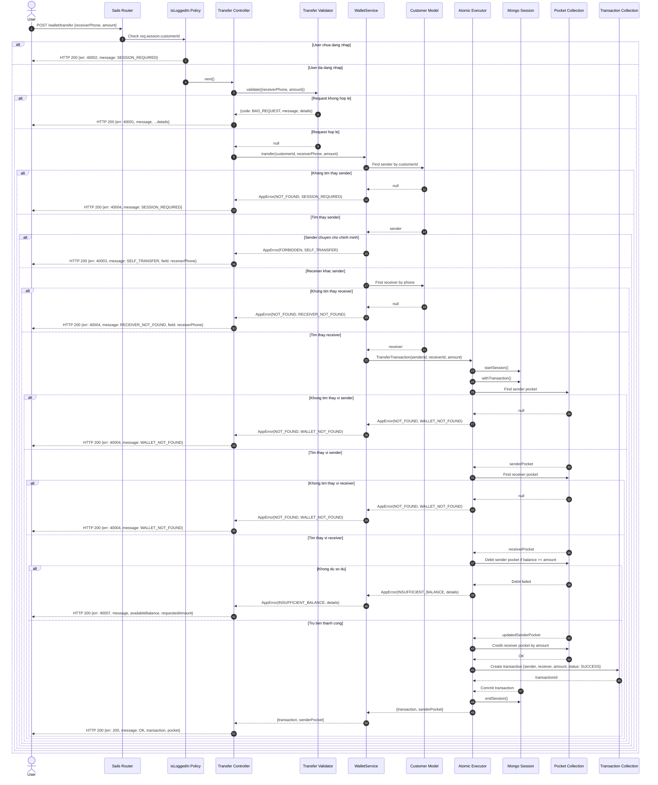

# Sequence Diagram: P2P Chuyen tien `/wallet/transfer`
## Luong chinh

## Mapping voi source code

| Thanh phan trong diagram | File trong source code |
| --- | --- |
| `POST /wallet/transfer` | `config/routes.js` |
| `isLoggedIn Policy` | `api/policies/isLoggedIn.js` |
| `Transfer Controller` | `api/controllers/wallet/transfer.js` |
| `Transfer Validator` | `api/validators/transfer.js` |
| `WalletService` | `api/services/WalletService.js` |
| `Atomic Executor` | `api/executors/Atomic.js` |
| `Customer Model` | `api/models/Customer.js` |
| `Pocket Collection` | `api/models/Pocket.js` |
| `Transaction Collection` | `api/models/Transaction.js` |
